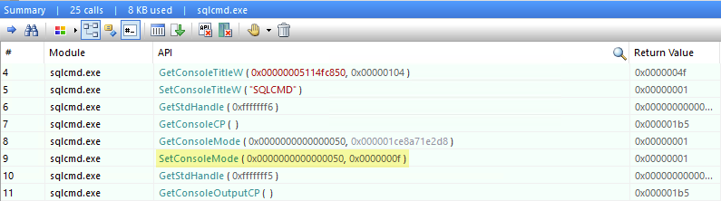

## SQLCMD disables ANSI Console support

> https://feedback.azure.com/forums/908035-sql-server/suggestions/42342169-running-sqlcmd-disables-ansi-console-output-suppor

When running `SQLCMD.exe`, it calls [`SetConsoleMode`](https://docs.microsoft.com/en-us/windows/console/setconsolemode) with hard-coded values, overriding any other options that might be enabled in the current console mode, including `ENABLE_VIRTUAL_TERMINAL_PROCESSING` which [provides support for ANSI escape codes](https://docs.microsoft.com/en-us/windows/console/console-virtual-terminal-sequences).

The consequence is that after running `SQLCMD.exe`, any ANSI output gets written in raw form, as control characters are not parsed for `VT100` and similar sequences that control cursor movement, color/font mode, and other operations that can also be performed via the existing Console APIs.



### Repro


```csharp
using System;
using System.Diagnostics;

namespace ReproBugSqlCmdDisablesAnsiSupport
{
    class Program
    {
        static void Main(string[] args)
        {
            // GOOD: This shows in the Console with colors
            Console.WriteLine("\u001b[41;1m\u001b[37;1mC. Augusto Proiete\u001b[0m");

            Process.Start("sqlcmd", "-???")?.WaitForExit();

            // BAD: ANSI support was disabled by SQLCMD and ANSI colors no longer work
            Console.WriteLine("\u001b[41;1m\u001b[37;1mC. Augusto Proiete\u001b[0m");
        }
    }
}

```

---

Bug discovered by [@nsmithdev](https://github.com/nsmithdev) via https://github.com/cake-build/cake/issues/3018
